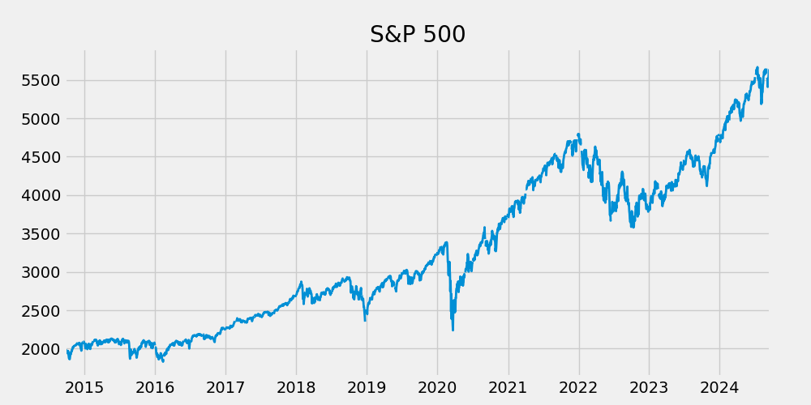
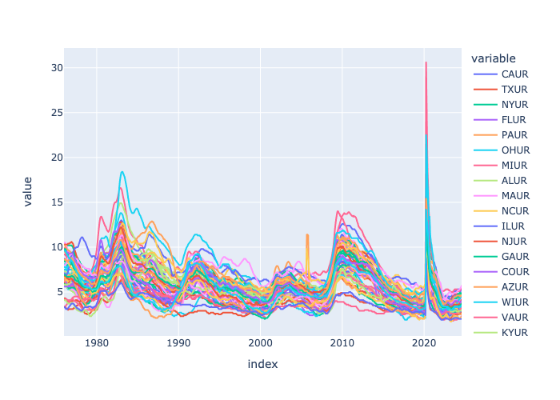
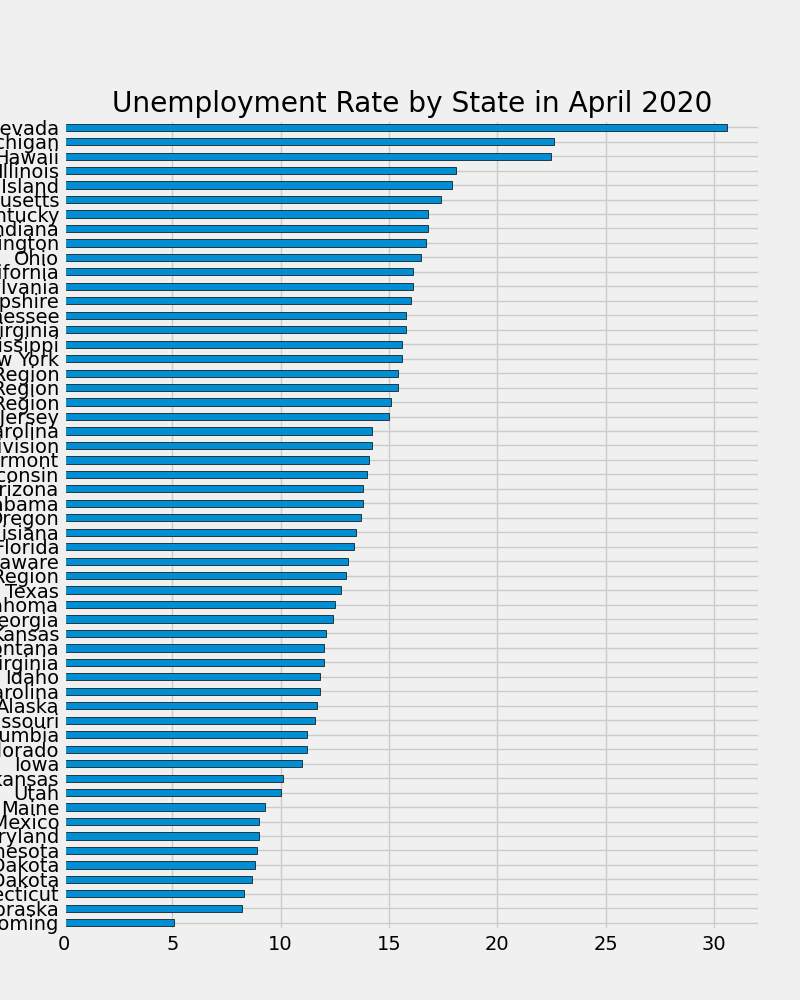
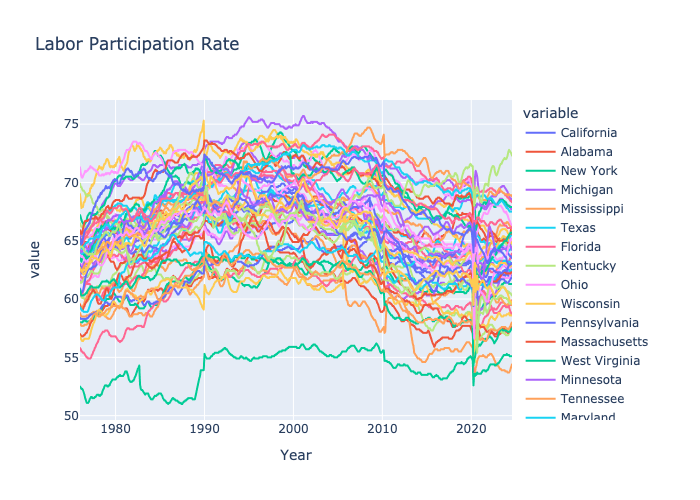
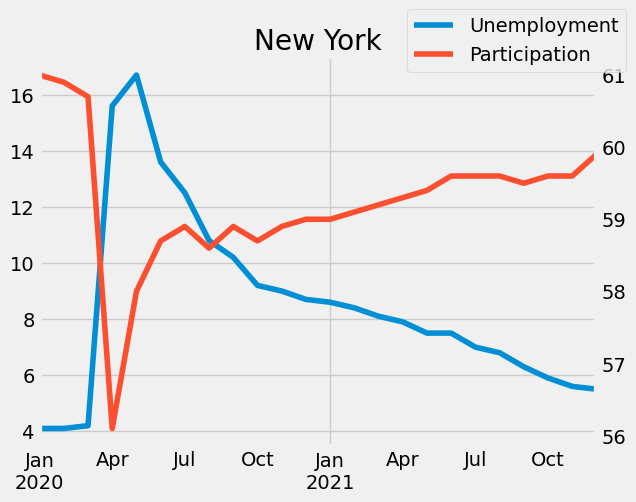

# Economic Data Analysis Project

## Overview
This project involves a comprehensive analysis of key economic indicators using the Federal Reserve Economic Data (FRED) API. The analysis focuses on the S&P 500 index, state-wise unemployment rates, and labor force participation rates. By leveraging Python libraries such as Pandas, Matplotlib, and Plotly, this project demonstrates the ability to extract, clean, analyze, and visualize complex economic datasets to derive meaningful insights into the health of the US economy and labor market dynamics.

## Technical Skills
- **Data Acquisition:** Integrated FRED API to automate data fetching for thousands of economic series.
- **Data Manipulation:** utilized Pandas for data cleaning, transformation, and aggregating state-level data.
- **Data Visualization:** Created interactive and static visualizations using Matplotlib and Plotly to identify trends and patterns.
- **Business Intelligence:** Synthesized raw data into actionable insights regarding economic stability, market volatility, and regional disparities.

## Key Findings and Economic Analysis

### 1. Market Performance (S&P 500)
The analysis of the S&P 500 index from 2014 to 2024 reveals the resilience and volatility of the stock market.
- **Pre-Pandemic Growth:** The market experienced consistent growth from 2014 to 2019, reflecting a strong economy.
- **COVID-19 Impact:** A sharp decline occurred in early 2020 due to the global pandemic, followed by one of the fastest recoveries in history later that year.
- **Recent Trends:** The period from 2022 to 2024 shows increased volatility driven by inflation concerns and interest rate adjustments, yet the market reached new highs in 2024, signaling strong corporate profitability.

### 2. Unemployment Trends
A deep dive into state-wise unemployment rates from 1976 to 2024 highlights cyclical economic patterns.
- **Historical Baseline:** Unemployment rates typically fluctuate between 5% and 10% across most states.
- **The Pandemic Spike:** The analysis captures the dramatic surge in unemployment during the COVID-19 crisis.
- **Regional Disparities:** Tourism-dependent states like Nevada and Hawaii and manufacturing hubs like Michigan were most severely impacted. Nevada, for instance, saw unemployment rates exceeding 30%. Conversely, states with lower population densities and agricultural economies, such as Wyoming and Nebraska, showed more resilience.

### 3. Labor Market Dynamics
The project further examines the Labor Force Participation Rate to understand workforce engagement.
- **Long-term Decline:** While participation rates generally ranged between 60% and 75%, there has been a gradual decline since 2000.
- **Unemployment vs. Participation:** Correlation analysis during the 2020-2022 recovery period illustrates an inverse relationship in states like New York. As unemployment rates stabilized and decreased following the initial pandemic shock, labor force participation began to recover, although at varying rates across different regions.

## Conclusion
This analysis underscores the significant impact of external shocks like the COVID-19 pandemic on the economy and the diverse recovery paths taken by different states. The ability to programmatic access and visualize this data allows for a granular understanding of economic health, moving beyond national averages to uncover regional stories.

## Author
Shubham Kulkarni